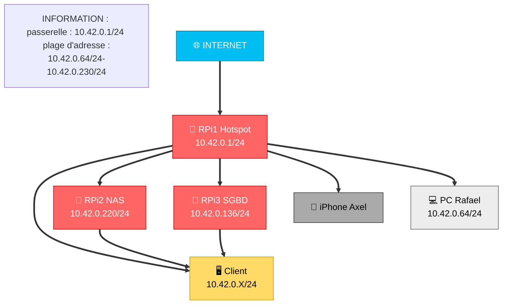

# **Documentation Technique – NAS Samba autonome (Raspberry Pi 5)**

## **Sommaire**

1. [Présentation](#1-présentation)
2. [Matériel utilisé](#2-matériel-utilisé)
3. [Configuration réseau](#3-configuration-réseau)
4. [Services installés](#4-services-installés)

   * [NAS Samba](#nas-samba)
   * [Service systemd Auto-Reboot](#service-systemd-auto-reboot)
5. [Scripts déployés](#5-scripts-déployés)

   * [Script principal – Installation NAS](#script-principal--installation-nas)
   * [Script secondaire – Ajout utilisateur](#script-secondaire--ajout-utilisateur)
6. [Arborescence des dossiers](#6-arborescence-des-dossiers)
7. [Accès au NAS](#7-accès-au-nas)
8. [Logs et supervision](#8-logs-et-supervision)
9. [Problèmes rencontrés et solutions](#9-problèmes-rencontrés-et-solutions)
10. [Avantages de la configuration](#10-avantages-de-la-configuration)

---

## **1. Présentation**

**Service installé** : NAS Samba autonome avec démarrage automatique et gestion de logs.

**Nom du groupe** : Noa & Axel 

**Date d’installation** : 03/10/2025.

**Objectif** :

* Fournir un NAS fiable avec dossiers **publics, privés et personnels**.
* Assurer la **résilience après coupure de courant** grâce à `systemd`.
* Centraliser les **logs d’installation et d’exécution**.
* Simplifier la gestion des utilisateurs Samba via un script dédié.

---

## **2. Matériel utilisé**

* **Raspberry Pi 5**
* **Support de stockage** : clé USB (`/dev/sda1`) formatée en ext4
* **Connexion réseau** : Wi-Fi (Hotspot du groupe)
* **Objectif** : Fournir un NAS avec dossiers publics, privés et personnels pour chaque utilisateur, accessible via SMB sur le réseau local.

* **Choix de l’installation graphique** :
Nous avons choisi la **version graphique de l’installation** pour faciliter la configuration initiale. Même si cela limite légèrement certaines options avancées, le bénéfice en termes de simplicité et de rapidité de mise en place est supérieur à ce que nous perdons en flexibilité.
---

## **3. Configuration réseau**

* Adresse IP (DHCP) : `10.42.0.220` (exemple)
* Masque : `255.255.255.0`
* Passerelle : `10.42.0.1`

---

### 🗺️ Schéma réseau (Mermaid)


---

## **4. Services installés**

### NAS Samba

* **Partages créés** :

  * `public` → RW groupe `smbusers`, lecture seule invités
  * `prive` → RW groupe `smbusers` uniquement


* **Permissions** :

  * Public : `0775`
  * Privé : `0770`

* **Fichier de config Samba** : `/etc/samba/smb.conf` (backup auto créé)

---

### Service systemd Auto-Reboot

Fichier : `/etc/systemd/system/nas-autoreboot.service`

```ini
[Unit]
Description=NAS Samba Auto-Reboot
After=network.target local-fs.target

[Service]
Type=oneshot
ExecStart=/usr/local/bin/install_nas_autoreboot.sh
RemainAfterExit=yes

[Install]
WantedBy=multi-user.target
```

➡️ Permet le redémarrage automatique du NAS à chaque boot, même après coupure d’alimentation.

---

## **5. Scripts déployés**

### Script principal – Installation NAS

📌 `/usr/local/bin/install_nas_autoreboot.sh`

Fonctionnalités :

* Vérifie présence du périphérique USB.
* Monte automatiquement via UUID (ajout à `/etc/fstab`).
* Crée dossiers publics et privés.
* Installe Samba et configure les partages.
* Sauvegarde du fichier `smb.conf`.
* Redémarre et active `smbd`.
* Log des opérations dans `/var/log/install_nas.log`.

---

### Script secondaire – Ajout utilisateur

📌 `/usr/local/bin/add_samba_user.sh`

Fonctionnalités :

* Création d’un utilisateur Linux (sans shell).
* Ajout à Samba avec mot de passe.
* Création d’un dossier personnel dédié.
* Mise à jour de `smb.conf` avec un partage individuel.
* Redémarrage automatique de Samba.

Pour ajouter des utilisateurs il faut : 
**Rendre le script exécutable**

```bash
sudo chmod +x /usr/local/bin/add_samba_user.sh
```

**Exécuter le script**

```bash
sudo ./add_samba_user.sh
```
---

## **6. Arborescence des dossiers**

```
/mnt/nas
├── public   (RW groupe smbusers, lecture seule invités)
├── prive    (RW groupe smbusers uniquement)
```

---

## **7. Accès au NAS**

* **Windows** : `\\10.42.0.220\`
* **MacOS** : `smb://10.42.0.220`
* **iPhone** : `smb://10.42.0.220`
* **Linux** : `gio mount smb://10.42.0.220/`

---

## **8. Logs et supervision**

* **Logs installation NAS** :

```bash
tail -f /var/log/install_nas.log
```

* **Logs Samba** :

```bash
tail -f /var/log/samba/log.smbd
```

* **Services actifs** :

```bash
systemctl list-units --type=service --state=running
```

---

## **9. Problèmes rencontrés et solutions**

* 🔴 **Périphérique USB absent au boot** → attente max 30s dans le script avant échec.
* 🔴 **Erreur de permissions sur le dossier privé** → corrigée avec `chmod 770`.
* 🔴 **Samba inactif après reboot** → corrigé avec `systemd`.
* 🔴 **Déconnexion en cas de perte de Wi-Fi t** → non corrigé, dû au Hotspot.

---

## **10. Avantages de la configuration**

✅ NAS **autonome et résilient** après coupure.

✅ **Redémarrage automatique** grâce à systemd.

✅ **Logs centralisés** pour débogage.

✅ Ajout utilisateurs **rapide** avec script dédié. 

✅ Désactivation de services inutiles pour gagner en ressources.

---
