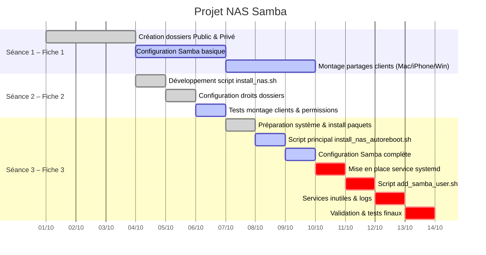

### 📅 Gantt - Projet NAS Samba (Séances 1 à 3)

```mermaid
gantt
    title Projet NAS Samba
    dateFormat  YYYY-MM-DD
    axisFormat  %d/%m

    section Séance 1 – Fiche 1
    Création dossiers Public & Privé      :done, a1, 2025-10-01, 3d
    Configuration Samba basique           :active, a2, after a1, 3d
    Montage partages clients (Mac/iPhone/Win) :active, a3, after a2, 3d

    section Séance 2 – Fiche 2
    Développement script install_nas.sh   :done, b1, 2025-10-04, 1d
    Configuration droits dossiers          :done, b2, after b1, 1d
    Tests montage clients & permissions    :active, b3, after b2, 1d

    section Séance 3 – Fiche 3
    Préparation système & install paquets  :done, c1, 2025-10-07, 1d
    Script principal install_nas_autoreboot.sh :active, c2, after c1, 1d
    Configuration Samba complète           :active, c3, after c2, 1d
    Mise en place service systemd          :crit, c4, after c3, 1d
    Script add_samba_user.sh               :crit, c5, after c4, 1d
    Services inutiles & logs               :crit, c6, after c5, 1d
    Validation & tests finaux              :crit, c7, after c6, 1d
```