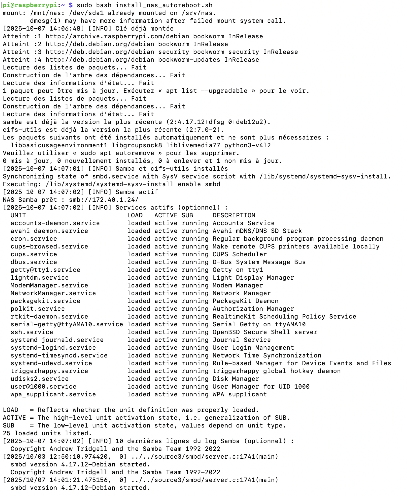
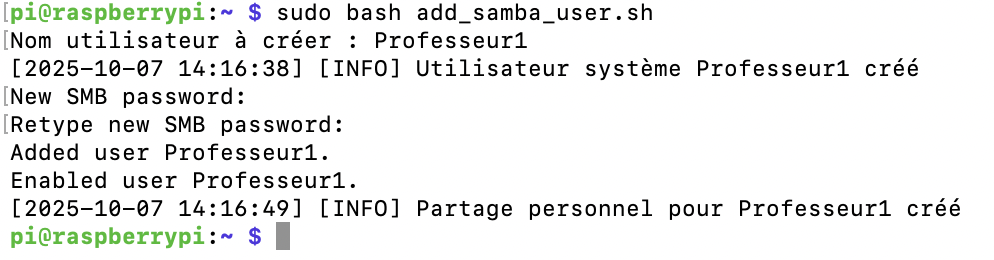

# **Tutoriel complet : NAS Samba autonome sur Raspberry Pi 5 avec services optionnels et logs**

## **Prérequis**

* Raspberry Pi 5 avec Raspberry Pi OS installé.
* Clé USB ou disque externe pour le stockage NAS.
* Accès root ou `sudo`.

> ⚡ **Note** : Nous installerons `samba` pour partager des dossiers et `cifs-utils` pour permettre le montage SMB/CIFS si le Pi devait accéder à d’autres partages réseau.

---

## **1️⃣ Préparer le Raspberry Pi**

1. Mettre à jour le système :

```bash
sudo apt update -y && sudo apt upgrade -y
```

2. Installer Samba et utilitaires CIFS :

```bash
sudo apt install -y samba cifs-utils
```

* `samba` = serveur pour partager des dossiers.
* `cifs-utils` = utilitaires pour monter et gérer des partages SMB/CIFS (utile pour tests ou accès à d’autres NAS).

---

## **2️⃣ Script principal : installer et configurer le NAS**

### **Créer le script**

```bash
sudo nano /usr/local/bin/install_nas_autoreboot.sh
```

### **Coller le script**

```bash
#!/bin/bash
# Script NAS Samba autonome - Raspberry Pi 5
set -e

# Variables principales
DEVICE="/dev/sda1"
MOUNT_POINT="/mnt/nas"
LABEL="NAS_USB"
CONF_FILE="/etc/samba/smb.conf"
GROUP="smbusers"
LOG_FILE="/var/log/install_nas.log"

# Fonction de log
log() {
    LEVEL=$1; shift
    TIMESTAMP=$(date '+%Y-%m-%d %H:%M:%S')
    echo "[$TIMESTAMP] [$LEVEL] $*" | tee -a "$LOG_FILE"
}

# Vérification root
[ "$(id -u)" -ne 0 ] && log ERROR "Doit être exécuté en root" && exit 1

# Préparer le fichier de log
mkdir -p /var/log
echo "===== NAS Samba Auto-Reboot - $(date) =====" > "$LOG_FILE"

# ------------------------------
# Désactiver services inutiles
# ------------------------------
for svc in bluetooth.service avahi-daemon.service; do
    if systemctl is-enabled $svc &>/dev/null; then
        systemctl disable $svc
        systemctl stop $svc
        log INFO "Service inutile $svc désactivé"
    fi
done

# Attente du périphérique USB
TIMEOUT=30; COUNTER=0
while [ ! -b "$DEVICE" ]; do
    log WARN "Périphérique $DEVICE non détecté, attente..."
    sleep 2
    COUNTER=$((COUNTER+2))
    [ $COUNTER -ge $TIMEOUT ] && log ERROR "Périphérique introuvable" && exit 1
done

# Formatage si nécessaire
if ! blkid $DEVICE | grep -q "TYPE="; then
    log WARN "Formatage de $DEVICE en ext4"
    mkfs.ext4 -F -L $LABEL $DEVICE
fi

# Montage
mkdir -p $MOUNT_POINT
UUID=$(blkid -s UUID -o value $DEVICE)
mount -U $UUID $MOUNT_POINT || log INFO "Clé déjà montée"
grep -q "$UUID" /etc/fstab || echo "UUID=$UUID $MOUNT_POINT ext4 defaults 0 2" >> /etc/fstab

# Dossiers partagés
mkdir -p $MOUNT_POINT/public $MOUNT_POINT/prive
chmod 775 $MOUNT_POINT/public
chmod 770 $MOUNT_POINT/prive
groupadd -f $GROUP
chown root:$GROUP $MOUNT_POINT/prive $MOUNT_POINT/public

# Installer Samba et CIFS-utils
apt update -y && apt install -y samba cifs-utils
log INFO "Samba et cifs-utils installés"

# Sauvegarde configuration existante
[ -f $CONF_FILE ] && cp $CONF_FILE $CONF_FILE.bak.$(date +%F-%T)

# Configuration Samba
cat <<EOF > $CONF_FILE
[global]
   workgroup = WORKGROUP
   server string = Raspberry Pi NAS
   map to guest = Bad User
   dns proxy = no
   log file = /var/log/samba/log.%m
   max log size = 1000
   panic action = /usr/share/samba/panic-action %d
   server role = standalone server
   obey pam restrictions = yes

[public]
   path = $MOUNT_POINT/public
   browseable = yes
   read only = yes
   guest ok = yes
   force group = $GROUP
   create mask = 0664
   directory mask = 0775
   write list = @$GROUP

[prive]
   path = $MOUNT_POINT/prive
   browseable = yes
   writable = yes
   valid users = @$GROUP
   create mask = 0660
   directory mask = 0770
EOF

# Redémarrage et activation Samba
systemctl restart smbd
systemctl enable smbd

# Vérification
systemctl is-active --quiet smbd && log INFO "Samba actif" || log ERROR "Samba inactif"

IP=$(hostname -I | awk '{print $1}')
echo "NAS Samba prêt : smb://$IP/"

# ------------------------------
# Affichage des services actifs
# ------------------------------
log INFO "Services actifs (optionnel) :"
systemctl list-units --type=service --state=running | grep -v "smbd\|nmbd"

# ------------------------------
# Affichage des logs
# ------------------------------
log INFO "10 dernières lignes du log Samba (optionnel) :"
tail -n 10 /var/log/samba/log.smbd || log WARN "Aucun log Samba trouvé"

if systemctl list-units --type=service | grep -q hostapd; then
    log INFO "Logs hostapd disponibles (optionnel) :"
    journalctl -u hostapd -n 10
else
    log INFO "Service hostapd non détecté (optionnel)"
fi
```

### **Rendre le script exécutable**

```bash
sudo chmod +x /usr/local/bin/install_nas_autoreboot.sh
```

### **Exécuter le script**

```bash
sudo bash install_nas_autoreboot.sh
```
#### **Résultat** 



---

## **3️⃣ Créer le service systemd pour auto-reboot**

### **Créer le fichier de service**

```bash
sudo nano /etc/systemd/system/nas-autoreboot.service
```

### **Coller le contenu**

```ini
[Unit]
Description=NAS Samba Auto-Reboot
After=network.target local-fs.target

[Service]
Type=oneshot
ExecStart=/usr/local/bin/install_nas_autoreboot.sh
RemainAfterExit=yes

[Install]
WantedBy=multi-user.target
```

### **Activer le service**

```bash
sudo systemctl daemon-reload
sudo systemctl enable nas-autoreboot.service
sudo systemctl start nas-autoreboot.service
```

✅ Le NAS démarre automatiquement au boot et attend le périphérique USB si nécessaire.

---

## **4️⃣ Script secondaire : ajouter un utilisateur Samba**

### **Créer le script**

```bash
sudo nano /usr/local/bin/add_samba_user.sh
```

### **Coller ce script**

```bash
#!/bin/bash
# Créer un utilisateur Samba avec dossier personnel
set -e

GROUP="smbusers"
MOUNT_POINT="/mnt/nas"
CONF_FILE="/etc/samba/smb.conf"
LOG_FILE="/var/log/install_nas.log"

log() {
    LEVEL=$1; shift
    TIMESTAMP=$(date '+%Y-%m-%d %H:%M:%S')
    echo "[$TIMESTAMP] [$LEVEL] $*" | tee -a "$LOG_FILE"
}

# Vérification root
[ "$(id -u)" -ne 0 ] && log ERROR "Doit être root" && exit 1

read -p "Nom utilisateur à créer : " USER
[ -z "$USER" ] && log ERROR "Nom vide" && exit 1

id "$USER" &>/dev/null || useradd -M -s /sbin/nologin "$USER" && log INFO "Utilisateur système $USER créé"
smbpasswd -a "$USER"
smbpasswd -e "$USER"
usermod -aG $GROUP "$USER"

USER_DIR="$MOUNT_POINT/$USER"
mkdir -p "$USER_DIR"
chown "$USER":$GROUP "$USER_DIR"
chmod 0700 "$USER_DIR"

cat <<EOF >> $CONF_FILE

[$USER]
   path = $USER_DIR
   browseable = yes
   writable = yes
   valid users = $USER
   create mask = 0600
   directory mask = 0700
EOF

systemctl restart smbd
log INFO "Partage personnel pour $USER créé"
```

### **Rendre le script exécutable**

```bash
sudo chmod +x /usr/local/bin/add_samba_user.sh
```
### **Exécuter le script**

```bash
sudo bash add_samba_user.sh
```
#### **Résultat** 


---

## **5️⃣ Utilisation**

### **Accéder au NAS**

* Public : `\\IP_RASPBERRY\public`
* Privé : `\\IP_RASPBERRY\prive` (nécessite un compte Samba)

### **Ajouter un utilisateur**

```bash
sudo /usr/local/bin/add_samba_user.sh
```

### **Vérifier les logs**

* Samba :

```bash
tail -f /var/log/samba/log.smbd
```

* Script NAS :

```bash
tail -f /var/log/install_nas.log
```


---

## ✅ **Avantages de cette configuration**

1. NAS autonome, auto-reboot après coupure.
2. Montage USB sécurisé et vérifié.
3. Services inutiles désactivés.
4. Logs centralisés et consultables.
5. Ajout utilisateurs Samba facile et rapide.
6. Sauvegarde des données, même en cas d'arrêt. 

---
